こんにちは。2週間くらい前に、ブイン基地に新規着任した下川です。  
前回AndroidStudioのインストールなど、一通りの環境構築を行いました。

いよいよ今回からは、アプリ開発に入っていきます。  
ちなみに本記事執筆時(10/02)には、AndroidStudio Ver0.2.10がアップデート可能となっていますので、確認してみてはいかがでしょうか？
（※10/4にVer0.2.11が出ました。詳細は下記で確認して下さい。）

[Android Tools Project Site](http://tools.android.com/recent)

## 新規プロジェクトの作成

AndroidStudioを起動した後に表示される、"Quick Start"から"New Project…"を選択しましょう。

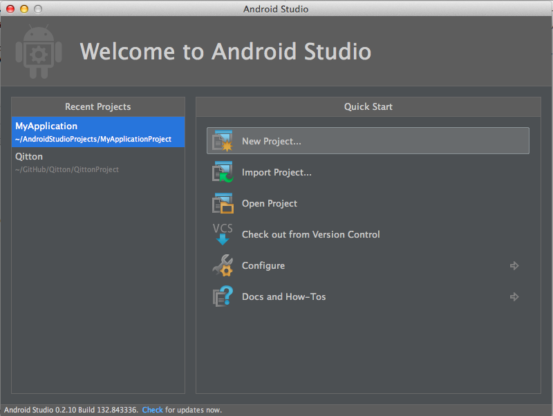

すると新規プロジェクト作成ウィザードに切り替わります。
ほとんど項目は、初期設定のままで問題ありません。
アプリ名などは適当に入れます。（ここでは、SDKの最小バージョンを4.0に変更しています。）

"The prefix 'com.example.' is meant as a placeholder and should not be used"と警告が出ていますが、Androidプロジェクトではお馴染みの「パッケージ名にcom.exampleは使わないで」なので、無視しても問題ありません。
（※厳密には問題あるのですが、ここでは省略します。）

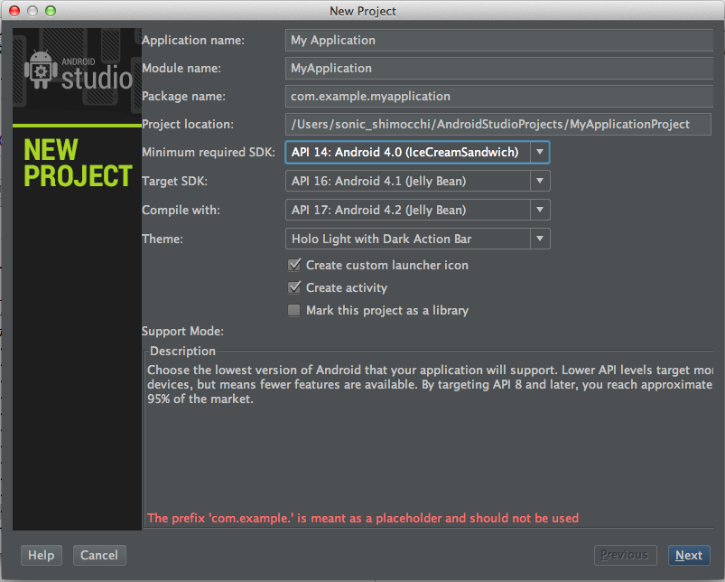

次はアプリのアイコン・ジェネレーターです。  
ここも初期状態のままで進みます。

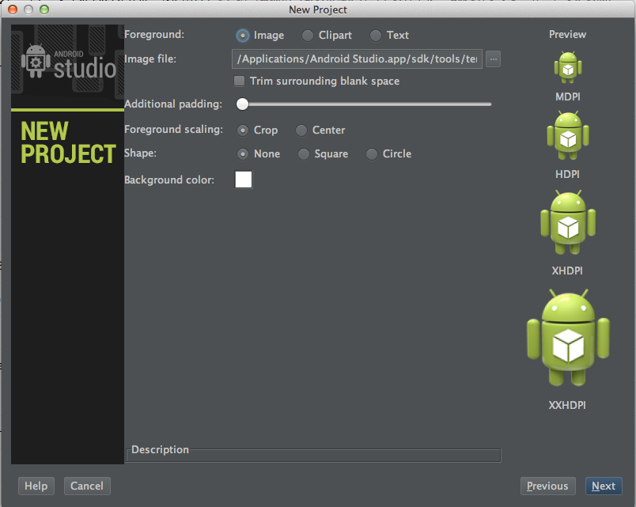

次はプロジェクトと一緒に作成するActivityのタイプを、設定出来ます。  
今回は"Blank Activity"を選択します。

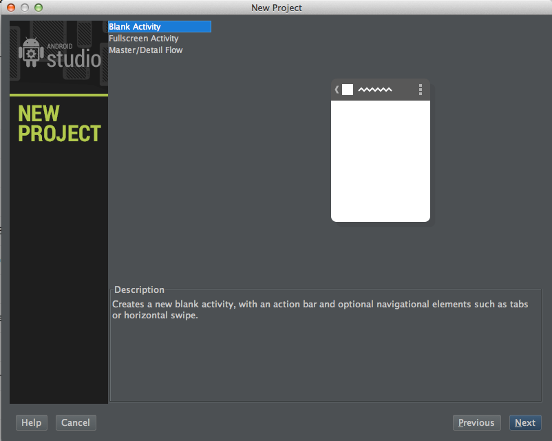

最後にActivityやLayoutの名称を指定します。  
ここもそのままの状態で、"Finish"を選択します。

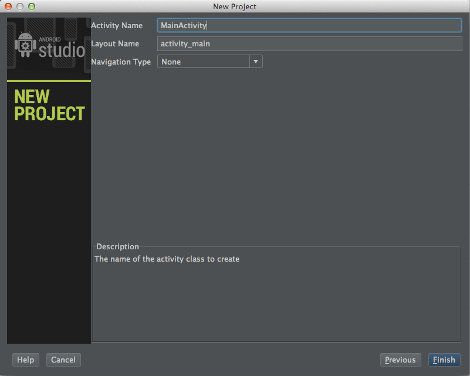

Gradle(AndroidStudioで採用しているビルドツール)の準備が終わると、作成したプロジェクト画面になります。  
好みではありますが、初期状態ではプロジェクトのツリー表示が非表示になっているので、あった方がいい場合は、"View -> Tool Windows -> Project"で表示出来ます。他にもAndroid DDMSなどのViewも配置出来ます。

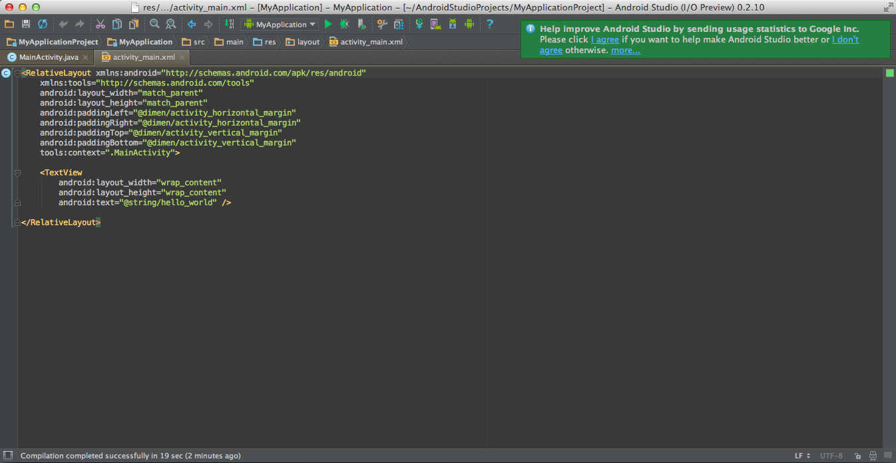

またLayoutファイルを選択すると、Previewが表示されます。表示されない時は、"View -> Tool Windows -> Preview"で表示出来ます。  
これはAndroidStudioの目玉機能の一つですので、ぜひ表示してみて下さい。

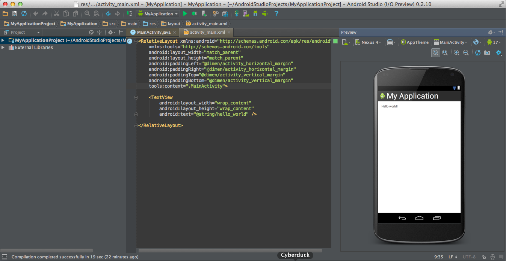

特筆すべきは、複数の画面サイズを一覧で確認出来る機能がある点です。  
やり方は、Previewの中にデバイスを選択出来るプルダウンがありますので、その中から"Preview All Screen Sizes"を選択します。すると、下図のようなたくさんの画面サイズでのPreviewが、一度に表示されます。

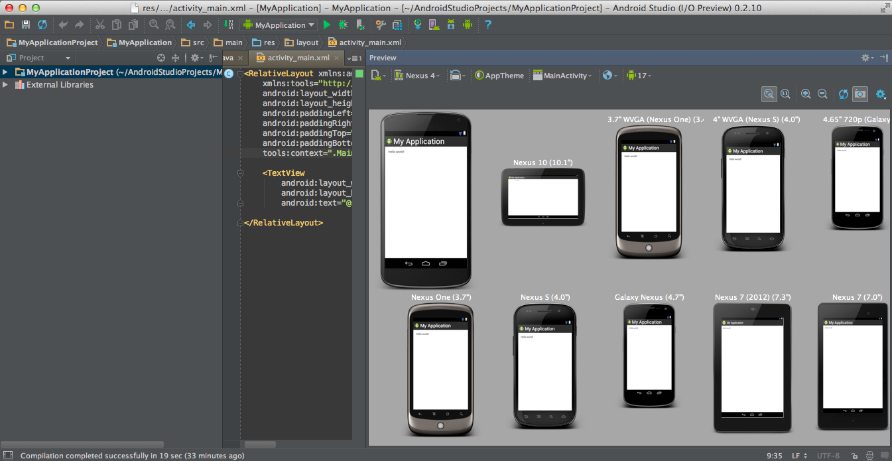

## Volleyライブラリを設定する

無事Androidプロジェクトが作成出来たので、さっそくVolleyのライブラリを追加してみます。  
AndroidStudioで外部ライブラリを追加するには、"build.gradle"というファイルに定義する必要があります。同名ファイルが複数あるのでややこしいですが、"src"と同階層にある"build.gradle"を使います。

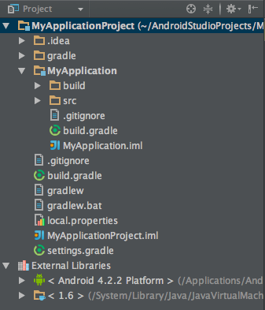

"build.gradle"ファイルを開くと、一番下に以下のような記述があると思います。

```
dependencies {
	// You must install or update the Support Repository through the SDK manager to use this dependency.
	// The Support Repository (separate from the corresponding library) can be found in the Extras category.
	// compile 'com.android.support:appcompat-v7:18.0.0'
}
```

デフォルトでSupport Libraryの設定が記述してあるようなのですが、これを使うにはSDK Managerで"Support Repository"を入れる必要があるみたいです。  
今回は必要無いのですが、とりあえずコメントに従ってSDK Managerを見てみましょう。"Tools -> Android -> SDK Manager"で起動出来ます。

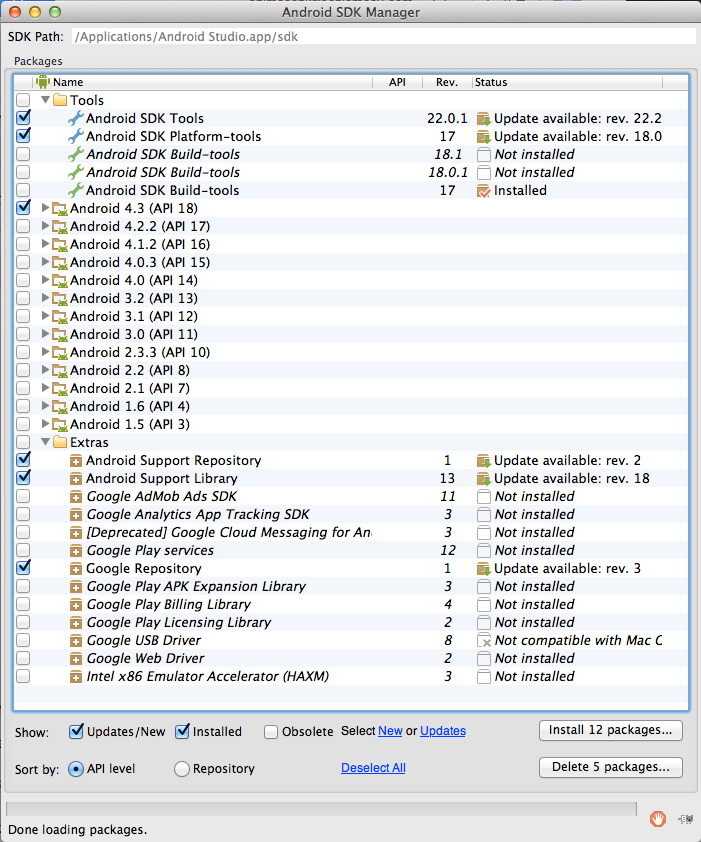

コメント通り"Support Repository"がExtrasの下にありますね。それ以外にも、私の環境ではSDK ToolsやSDK Platform-toolsなどのアップデートもあるようです。
今回は冒頭でAndroidStudioのアップデートをしたので、これらツールもアップデートしておきます。

ライブラリを格納するためのディレクトリを、"libs"という名称で以下の場所に作成します。
この中に前回作成した"volley.jar"ファイルを、ドラッグ＆ドロップ等でコピーします。

"volley.jar"を追加出来たら、先ほどの"build.gradle"ファイルに以下を追記します。

```
    compile files('libs/volley.jar')
```

基本的には自動保存後リビルドされて、自動でライブラリとして認識してくれるはずです。
うまく認識したかどうかは、"File -> ProjectStructure…"を開いてみると分かります。以下のようになっていれば、きちんとライブラリとして認識されています。

もしうまく認識してくれない場合は、"Tools -> Android -> Synch Project with Gradle Files"を実行してみて下さい。これを実行すると、"build.gradle"の記述がプロジェクトの設定ファイルに取り込まれます。

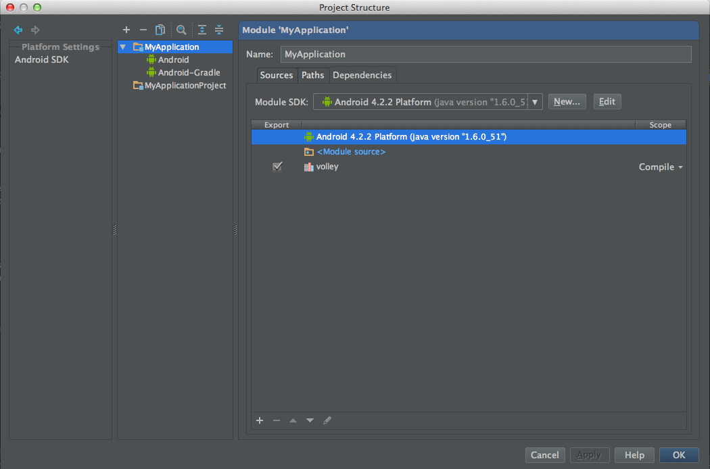

ライブラリ追加後は、以下のようになっているかと思います。    

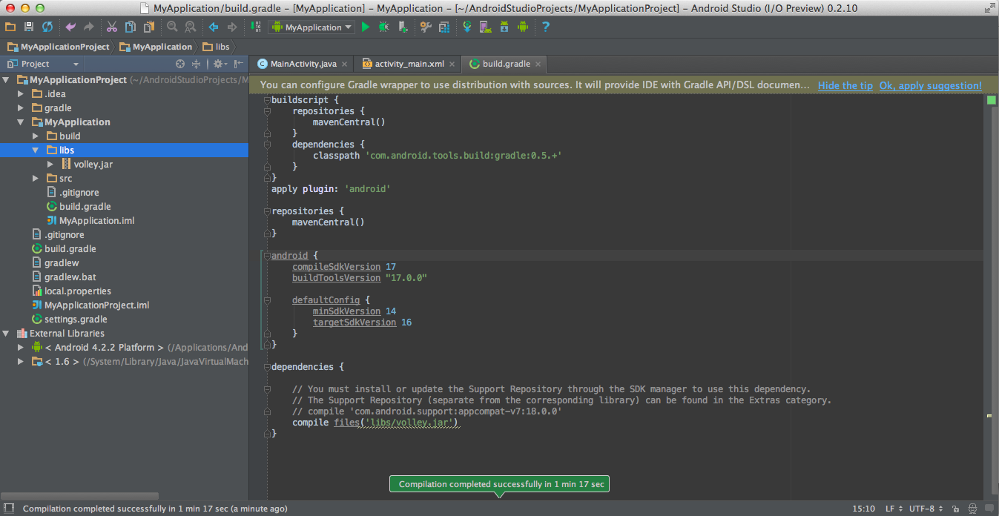

## 試しにVolleyで通信してみる

本当にVolleyを使って通信出来るのか、簡単に試してみようと思います。動くのを見た方が楽しいですしね。  
Volleyのリクエストキューは、シングルトンで管理されているようです。まずはそのリクエストキューを生成するコードを、"MainActivity.java"に書いてみます。

```
public class MainActivity extends Activity {
    
    private RequestQueue mQueue;
    
    @Override
    protected void onCreate(Bundle savedInstanceState) {
        super.onCreate(savedInstanceState);
        setContentView(R.layout.activity_main);
        
        mQueue = Volley.newRequestQueue(getApplicationContext());
        requestVolley();
    }
```

ちなみに、RequestQueueクラスはVolleyが提供しているクラスなのですが、ライブラリとして認識済みなので、以下のように補完が効きます。慣れてくると、すごく便利です。

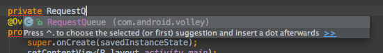

最後の`requestVolley()`メソッドでリクエストを処理します。中身は以下のように、privateメソッドとして定義してみます。

```
    private void requestVolley() {
        // リクエスト生成 : Qiitaから新規投稿を取得
        String url = "https://qiita.com/api/v1/items";
        mQueue.add(new JsonArrayRequest(url,
                new Response.Listener<JSONArray>() {
                    @Override
                    public void onResponse(JSONArray response) {
                        Log.d("MainActivity", "response : " + response.toString());
                    }
                },
                new Response.ErrorListener() {
                    @Override
                    public void onErrorResponse(VolleyError volleyError) {
                        Log.e("MainActivity", "error! : " + volleyError.toString());
                    }
                }));
        mQueue.start();
    }
```

せっかくなら意味のあるデータを取ってきたいので、早速Qiitaから取ってくるようにします。`https://qiita.com/api/v1items`というAPIを投げると、新規投稿をJSON形式で取得出来ます。  
リクエストの生成には、VolleyのJsonArrayRequestクラスを使っています。コンストラクタに渡しているものは第1パラメータから順に、リクエストURL、成功時リスナー、失敗時リスナーとなっています。

あとはアプリで通信をしなければいけないので、インターネットにアクセスするパーミッション付与を忘れずに追加します。  
僕は忘れたので、ログで以下のようなエラーを見ました。

```
13749-13769/com.example.myapplication E/Volley﹕ [3732] NetworkDispatcher.run: Unhandled exception java.lang.SecurityException: Permission denied (missing INTERNET permission?)
```

こうならないように"AndroidManifest.xml"を開いて、<application>タグの外に以下を追記します。

```
    <uses-permission android:name="android.permission.INTERNET" />
```

環境にもよりますが、この時点で以下のような感じになっているかと思います。

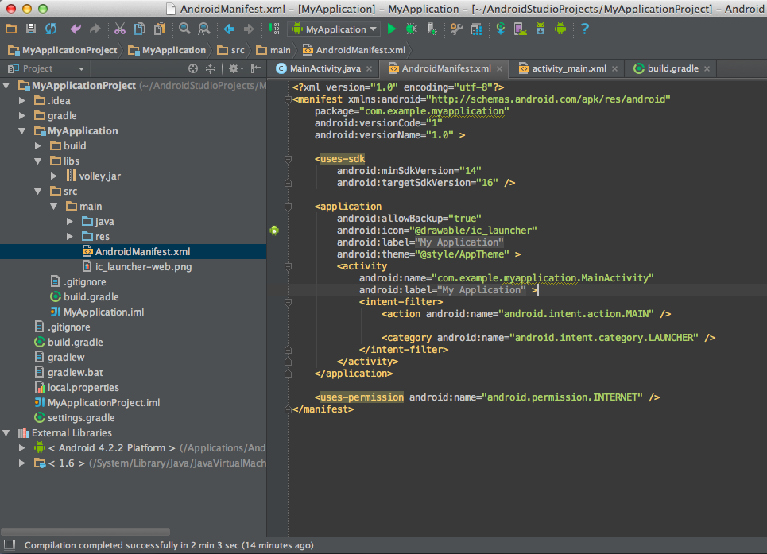

以上で、うまくいけばQiitaサイトから新規投稿データを取得出来るはずです。かなりシンプルですね。  
では"Run -> Run 'MyApplication'"で実行してみます。
実機があれば一番いいですが、無い場合はエミュレータでもいいかと思います。（※エミュレータの作成については、ここでは割愛します。）

JSONデータをログに出力しているだけなので、かなり見づらいかと思いますが、それっぽいものが取得出来ました。

```
14768-14768/com.example.myapplication D/MainActivity﹕ response : [{"comment_count":0,"stock_users":[],"tags":[{"icon_url":"https:...
```

## まとめ

ちょっと長くなりましたが、ひとまず以下のことが達成出来ました。

* AndroidStudioで新規プロジェクト作成
* Volleyライブラリを組み込む
* Volleyを使った通信を試してみる

Volleyを使った通信処理は、シンプルに実装出来るみたいなので可読性も良く、素晴らしいライブラリだと思いました。活用出来れば、Androidの通信処理がスッキリしそうです。

次回は、取得したQiitaの投稿データを画面に表示する部分を、実装してみたいと思います。